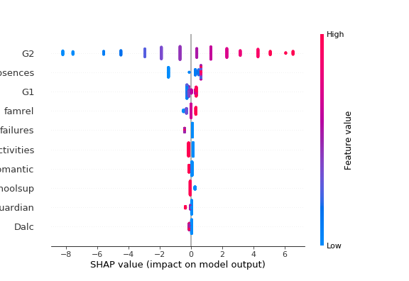

# Shapley Bootstrapping


Shapley bootstrapping is a novel machine learning methodology, that harmonizes ensemble learners with Shapley values. For detailed explanation, see my [thesis].


# Install
Shapley-bootstrapping can be installed via [PyPi](https://pypi.org/)

```
pip install shap-bootstrapping
```

This library automatically installs the following dependancies:

    1.scipy
    2.pandas
    3.openml
    4.xgboost
    5.scikit-learn
    6.seaborn
    7.shap
    8.matplotlib


# Overview
This library includes the implementations of eight pipelines from [paper]. These pipelines are:


Each of these pipelines are already implemented in the library(except 3 and 6, which are special cases) and can be directly used to train and predict over datasets.


# Usage
Name of the module is `shap_bootstrap`. From this module, you can import the following sub-modules:

1. `building_blocks`
2. `cluster`
3. `custom_pipeline`
4. `datasets`
5. `utils`
6. `visualisation`


In order to follow the experiments from the [paper] or start with a quick example, you can use the `custom_pipeline` module for creating a pre-built pipeline using custom building blocks.

These 5 building_block classes are:
1. `ProcessingBlock`
   * This block is for input pre-processing.   Used for input scaling,imputing and train-test splitting
2. `ExplainerBlock`
   * This block trains the Shap Explainer.Currently trains an internal XGBoost Regressor, but will be changed in the future. 
3. `ClusterBlock`
   * This block takes two algorithms : One unsupervised clustering algorithm and one classifier model. In our research we have used K-Means and K-NN , but these models can be changed to any other for experimentation.
4. `EnsembleBlock`
   * Ensemble block trains a set of individual XGBoost regressors over the clustered data. Currently XGBoost model is internally constructed, but will be made parametric.
5. `ReduceBlock`
   * Reduce block runs PCA over the data to project into lower dimensionality. Currently, PCA is fitted until 95\% variance ratio is captured.

In an example below, we will implement Branch8 which uses dimensionality reduction, clustering and ensemble training using these building blocks.


*Workflow of branch8*


The process sequence of this workflow is as follows:
1.  Explainer Block inputs datasets, fits a [Shapley Explainer](https://github.com/slundberg/shap/blob/fc30c661339e89e0132f5f89e5385e3681090e1f/shap/explainers/tree.py#L39)
2.  Reduce Block projects feature space to lower dimensions using PCA with 95\% explained variance ratio
3.  Cluster Block exercises given clustering algorithm(K-means in our case) and labels instances
4.  One-to-one mapper maps these labels back to original instances
5.  Ensemble block trains a model(XGBoost in this case) over each cluster

```python
import math
from shap_bootstrap.building_blocks import *
from shap_bootstrap import datasets
from shap_bootstrap.custom_pipeline import B8_Branch_Pipeline
from sklearn.cluster import KMeans
from sklearn.neighbors import KNeighborsClassifier
from sklearn.model_selection import train_test_split
from sklearn import metrics

# Returns boston dataset & train-test split
X,y,name = datasets.returnDataset(9)
X_train,X_test,y_train,y_test = prepare_pipeline_data(X,y)

# Building blocks to be used in pipeline
# All algorithms can be changed with other models except PCA
explainer_type = 'XGBoost'
model_type = 'XGBoost'
nClusters = 3
processing_block = ProcessingBlock()
explainer_block = ExplainerBlock(explainer_type)
reduce_block = ReduceBlock(PCA(1))
cluster_block = ClusterBlock(nClusters,KMeans(n_clusters = nClusters,random_state = 0),KNeighborsClassifier(n_neighbors = nClusters))
ensemble_block = EnsembleBlock(model_type)

# Instantianate Branch 8 pipeline
branch8 = B8_Branch_Pipeline(processing_block,explainer_block,reduce_block,cluster_block,ensemble_block)

# Fit and predict
branch8.fit(X_train,y_train)
y_pred = branch8.predict(X_test)
err = math.sqrt(metrics.mean_squared_error(y_test,y_pred))

```

This code snippet implements branch8, trains  over the `student_grades` dataset and makes predictions. Now, we can further evaluate our predictions.

# Evaluation of results
We can visualise model predictions via:
```python
ax = sns.scatterplot(x = y_test,y = y_pred)
ax.plot([0,50],[0,50],color = 'red' ,   linestyle='--')
ax.set_xlabel('True label')
ax.set_ylabel('Pipeline predictions')
ax.set_title('Divergence of predictions from true label')
ax.legend(['Identity','RMSE = {:.2f}'.format(err)])
```


*Plot of prediction error, blue dots is our model, red line is the best prediction*

In the plot, we observe that other than couple outlier predictions our model fitted the data well.

# Interpreting Features
We can further check the Shapley values as further interpretation of feature importances:


```python
explainer = branch8.explainer_block.explainer
shap.initjs()
shap.summary_plot(explainer.shap_values(X_train),X_train,X.columns,max_display=10)
```

which outputs following plot :



Here, we see the features ranked descending by the sum of Shapley value magnitudes over all samples. Namely, they are ranked in feature importance top to bottom. For example, feature `G2` is positively correlated with output, such that high values of `G2` increase the output label and vice versa.

With this capability, we can inspect on feature importances, which will aid the interpretability of the model.

# Model-agnostic functionality
The training pipelines take machine learning models as arguments in instantianation. Therefore, it is possible to run the experimentations with different models. TShap-bootstrap offers a flexbility in implementation.