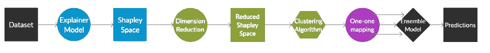

# Shapley Bootstrapping

- [x]   Flexible
   - Provides building blocks for constructing a pipeline. Workflow of pipelines and machine learning models used in the pipeline are defined by user choice.
- [x]   Effective 
  -   Improves prediction performance via Shapley values and clustering based ensemble training.
- [x]   Explainable
   - Uses Shapley values for explaining machine learning models.

Shapley bootstrapping is a novel machine learning methodology that harmonizes ensemble learners with Shapley values. For detailed explanation, see my [thesis].


# Install
Shapley-bootstrapping can be installed via [PyPi](https://pypi.org/)

```
pip install shap-bootstrap
```

This library automatically installs the following dependancies:

    1.scipy
    2.pandas
    3.openml
    4.xgboost
    5.scikit-learn
    6.seaborn
    7.shap
    8.matplotlib


# Overview
This library includes the implementations of eight pipelines from [paper]. These pipelines are:


Each of these pipelines are already implemented in the library(except 3 and 6, which are special cases) and can be directly used to train and predict over datasets.


# Usage (Flexible)
Name of the module is `shap_bootstrap`. From this module, you can import the following sub-modules:

1. `building_blocks`
2. `cluster`
3. `custom_pipeline`
4. `datasets`
5. `utils`
6. `visualisation`


In order to follow the experiments from the [paper] or start with a quick example, you can use the `custom_pipeline` module for creating a pre-built pipeline using custom building blocks.

These 5 building_block classes are:
1. `ProcessingBlock`
   * This block is for input pre-processing. Used for input scaling,imputing and train-test splitting
2. `ExplainerBlock`
   * This block trains the Shap Explainer. Currently trains either Linear Regressor(keyword `Linear`) or XGBoost Regressor (keyword `XGBoost`), but will be changed in the future. 
3. `ClusterBlock`
   * This block takes two algorithms : One unsupervised clustering algorithm and one classifier model. In our research we have used K-Means and K-NN , but these models can be changed to any other for experimentation.
4. `EnsembleBlock`
   * Ensemble block trains a set of individual XGBoost regressors over the clustered data. Currently either Linear Regressor(keyword `Linear`) or XGBoost Regressor (keyword `XGBoost`) but will be made parametric.
5. `ReduceBlock`
   * Reduce block runs PCA over the data to project into lower dimensionality. Currently, PCA is fitted until 95\% variance ratio is captured.

In an example below, we will implement Branch8 which uses dimensionality reduction, clustering and ensemble training using these building blocks.


*Workflow of branch8*


The process sequence of this workflow is as follows:
1.  Explainer Block inputs datasets, fits a [Shapley Explainer](https://github.com/slundberg/shap/blob/fc30c661339e89e0132f5f89e5385e3681090e1f/shap/explainers/tree.py#L39) and calculates Shapley values of instances
2.  Reduce Block projects feature space to lower dimensionality using PCA with 95\% explained variance ratio
3.  Cluster Block exercises given clustering algorithm(K-means in our case) and labels instances
4.  One-to-one mapper maps these labels back to original instances
5.  Ensemble block trains a model(XGBoost in this case) over each cluster

```python
import math
from shap_bootstrap.building_blocks import *
from shap_bootstrap import datasets
from shap_bootstrap.custom_pipeline import B1_Branch_Pipeline,B8_Branch_Pipeline
from shap_bootstrap.utils import prepare_pipeline_data
from sklearn.cluster import KMeans
from sklearn.neighbors import KNeighborsClassifier
from sklearn.model_selection import train_test_split
from sklearn import metrics

# Returns student_grades dataset & train-test split
X,y,name = datasets.student_grades()
X_train,X_test,y_train,y_test = prepare_pipeline_data(X,y,random_state = 42)

# Building blocks to be used in pipeline
# All algorithms can be changed with other models except PCA
explainer_type_b1 = 'XGBoost'
explainer_type_b8 = 'Linear'
model_type = 'XGBoost'
nClusters = 4

processing_block_b1 = ProcessingBlock()
explainer_block_b1 = ExplainerBlock(explainer_type_b1)
cluster_block_b1 = ClusterBlock(nClusters,KMeans(n_clusters = nClusters,random_state = 0),KNeighborsClassifier(n_neighbors = nClusters))
ensemble_block_b1 = EnsembleBlock(model_type)

# Instantianate Branch 1 pipeline
branch1 = B1_Branch_Pipeline(processing_block_b1,explainer_block_b1,cluster_block_b1,ensemble_block_b1)

processing_block_b8 = ProcessingBlock()
explainer_block_b8 = ExplainerBlock(explainer_type_b8)
reduce_block_b8 = ReduceBlock(PCA(1))
cluster_block_b8 = ClusterBlock(nClusters,KMeans(n_clusters = nClusters,random_state = 0),KNeighborsClassifier(n_neighbors = nClusters))
ensemble_block_b8 = EnsembleBlock(model_type)

# Instantianate Branch 8 pipeline
branch8 = B8_Branch_Pipeline(processing_block_b8,explainer_block_b8,reduce_block_b8,cluster_block_b8,ensemble_block_b8)

# Fit and predict
branch1.fit(X_train,y_train)
y_pred_b1 = branch1.predict(X_test)
err_b1 = math.sqrt(metrics.mean_squared_error(y_test,y_pred_b1))
branch8.fit(X_train,y_train)
y_pred_b8 = branch8.predict(X_test)
err_b8 = math.sqrt(metrics.mean_squared_error(y_test,y_pred_b8))
```

This code snippet implements branch8, trains  over the `student_grades` dataset and makes predictions. Now, we can further evaluate our predictions.

# Evaluation of results (Effective)
We can visualise model predictions via:
```python
import matplotlib.pyplot as plt
ax = plt.subplot()
ax.scatter(x=y_test,y = y_pred_b1)
ax.scatter(x = y_test,y = y_pred_b8)
ax.plot([0,25],[0,25],color = 'red',linestyle='--')
ax.set_xlabel('True label')
ax.set_ylabel('Pipeline predictions')
ax.set_title('Divergence of predictions from true label')
new_labels = ['Identity', 'XGBoost Model - RMSE: {:.3f}'.format(err_b1), 'Shap-bootstrap - RMSE: {:.3f}'.format(err_b8)]
ax.legend(new_labels)
```


*Plot of prediction error, blue dots is our model, red line is the best prediction*

In the plot, we observe that our proposed methodology can improve the performance of an existing XGBoost model, by fitting the data better (Orange points lie closer to the identity line). We improved the RMSE value by 5\%, but this is not a major improvement.

# Interpreting Features (Explainable)
We can further check the Shapley values as further interpretation of feature importances:


```python
explainer = branch8.explainer_block.explainer
shap.initjs()
shap.summary_plot(explainer.shap_values(X_train),X_train,X.columns,max_display=10)
```

which outputs following plot :


Here, we see the features ranked descending by the sum of Shapley value magnitudes over all samples. Namely, they are ranked in feature importance top to bottom. For example, feature `G2` is positively correlated with output, such that high values of `G2` increase the output label and vice versa.

With this capability, we can inspect on feature importances, which will aid the interpretability of the model.

# Model-agnostic functionality (Flexible)
The training pipelines take machine learning models as arguments in instantianation. Therefore, it is possible to run the experimentations with different models. Shap-bootstrap offers a flexbility in implementation.
